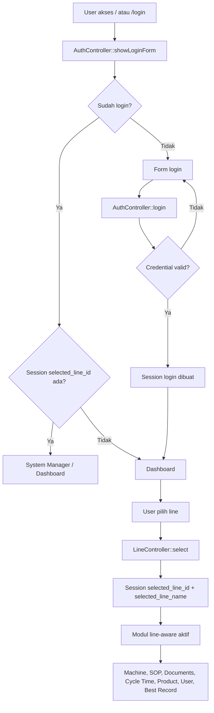

# Alur Program Web Aplikasi DX AISS Central Dashboard

Dokumen ini menjelaskan alur kerja aplikasi dari awal akses hingga ke halaman utama dan modul fungsional yang tersedia.

## 1. Gambaran umum

Aplikasi ini adalah dashboard web berbasis Laravel yang memiliki alur utama:

1. User masuk ke halaman login.
2. Setelah login, user diarahkan ke dashboard.
3. Jika user belum memilih line produksi, aplikasi akan memintanya memilih line melalui session.
4. Setelah line terpilih, user dapat mengakses modul seperti mesin, SOP, produk, document, cycle time, user management, dan system manager.
5. Data utama banyak dipfilter berdasarkan `selected_line_id` pada session agar setiap line menampilkan datanya sendiri.

## 2. Entry point aplikasi

Routing utama ada di `routes/web.php`.

### Route publik

- `/` dan `/login` diarahkan ke `AuthController::showLoginForm()`
- `/login` dengan method `POST` diproses oleh `AuthController::login()`
- `/logout` diproses oleh `AuthController::logout()`
- `/register` diproses oleh `AuthController::register()`

Artinya, aplikasi dimulai dari proses autentikasi sebelum user masuk ke dashboard atau modul lain.

## 3. Alur login dan autentikasi

### 3.1 Proses login

Saat user membuka aplikasi, `AuthController::showLoginForm()` dijalankan.

Logikanya:

- Jika user sudah login, aplikasi akan langsung redirect ke:
  - `system-managers.index` jika session `selected_line_id` sudah ada
  - `dashboards.index` jika belum ada line yang dipilih
- Jika belum login, aplikasi menampilkan halaman login dan daftar line yang tersedia.

### 3.2 Validasi login

`AuthController::login()` melakukan validasi:

- `npk` wajib diisi
- `password` wajib diisi

Jika valid, Laravel `Auth::attempt()` dipanggil untuk mengecek credential.

Jika berhasil:

- session diregenerasi
- user diarahkan ke `dashboards.index`
- pesan sukses ditampilkan

Jika gagal:

- user dikembalikan ke halaman sebelumnya
- muncul error `NPK atau password salah`

### 3.3 Logout

`AuthController::logout()` akan:

- memanggil `Auth::logout()`
- menghapus sesi
- mereset CSRF token
- redirect ke halaman login

## 4. Alur pemilihan line

Setelah login, aplikasi memerlukan konteks line aktif yang dipilih user.

### 4.1 Route pemilihan line

Ada tiga route penting:

- `GET /select-line` -> `LineController::index()`
- `POST /select-line` -> `LineController::select()`
- `POST /clear-line` -> `LineController::clear()`

### 4.2 Proses pemilihan line

`LineController::select()` bekerja sebagai berikut:

- validasi `line_id`
- cari data line dari database
- simpan ke session:
  - `selected_line_id`
  - `selected_line_name`
- redirect ke `system-managers.index`

### 4.3 Middleware line selection

Middleware `EnsureLineSelected` memastikan bahwa user hanya bisa mengakses area tertentu setelah memilih line.

Jika `selected_line_id` belum ada, maka user akan diarahkan ke dashboard dengan informasi:

> Silakan pilih Line terlebih dahulu melalui modal pada dashboard.

Ini penting karena banyak halaman di aplikasi difilter berdasarkan line yang sedang aktif.

## 5. Struktur route berdasarkan autentikasi dan line

Route utama dikelompokkan seperti berikut:

### 5.1 Grup authenticated

```php
Route::middleware(['auth'])->group(function () {
    // dashboard
    Route::resource('dashboards', DashboardController::class);

    // line selector
    Route::get('/select-line', [LineController::class, 'index'])->name('line-selector.index');
    Route::post('/select-line', [LineController::class, 'select'])->name('line-selector.select');
    Route::post('/clear-line', [LineController::class, 'clear'])->name('line-selector.clear');
```

Setelah login, user bisa masuk ke dashboard dan area pemilihan line.

### 5.2 Grup dengan middleware `line.selected`

Semua modul yang tergantung line aktif dibungkus dalam middleware `line.selected`:

- machine management
- system manager
- user management
- best records
- line performance
- product management
- documents
- cycle time monitoring
- cycle time setting

Artinya, sebelum masuk ke modul ini, aplikasi memastikan line sudah dipilih.

## 6. Alur masuk ke dashboard

`DashboardController::index()` adalah halaman utama setelah login.

Fungsi ini mengambil berbagai data dari service-layer:

- `BestRecordService`
- `LinePerformanceService`
- `CycleTimeService`
- `ProductService`
- `MarqueeTextService`
- `PatternService`
- `PatternHistoryService`

Data yang diambil lalu dikirim ke view `dashboards.index`.

### Perhatikan

Pada dashboard, `DashboardController` saat ini menggunakan nilai hardcoded:

```php
$dashboardLineId = 2;
```

Artinya, tampilan dashboard kiosk saat ini secara default diarahkan ke Line 2, meskipun line aktif pada session dapat berubah di area management.

## 7. Alur data dashboard

Berikut urutan data yang biasanya diambil saat dashboard dibuka:

1. Ambil best record
2. Ambil line performance
3. Ambil cycle time berdasarkan line tertentu
4. Ambil daftar produk
5. Ambil marquee text
6. Ambil pattern aktif
7. Ambil pattern history untuk line tersebut
8. Tampilkan semua data pada view dashboard

## 8. Alur modul utama

### 8.1 System Manager

`SystemManagerController::index()` mendapatkan `selected_line_id` dari session, lalu menghitung:

- jumlah machine pada line terpilih
- jumlah SOP pada line terpilih
- SOP yang memiliki risk assessment
- matriks risiko berdasarkan rank A, C, E

Dengan cara ini, tampilan system manager selalu terikat ke line yang sedang aktif.

### 8.2 Machine Management

`MachineController` mengelola data mesin. Route-nya menggunakan resource:

- `machines.index`
- `machines.store`
- `machines.update`
- `machines.destroy`
- `machines.sop.attach`
- `machines.sop.detach`

### 8.3 Product Management

`ProductController` menangani data produk.

Ada route tambahan:

- `/fetch-products-table` -> `DashboardController::fetchProductsTable()`

Fungsi ini mengambil data produk untuk ditampilkan ulang pada tabel dashboard tanpa reload penuh halaman.

### 8.4 Documents

Document area terbagi dalam beberapa modul:

- `documents` -> `DocumentController::index()`
- `documents/dasg` -> `DasgController`
- `documents/sop` -> `SopController`
- `documents/risk-assessment` -> `RiskAssessmentController`

Masing-masing modul digunakan untuk mengelola dokumen berdasarkan line aktif.

### 8.5 Cycle Time

`CycleTimeController` memiliki route:

- `/cycletimes/monitoring`
- `/cycletimes/monitoring/export-csv`
- `/cycletimes/monitoring/export-pdf`

Sementara pengaturan pattern cycle time diatur oleh `PatternController`:

- `/cycletimes/setting`
- `/cycletimes/setting/upload-map`

Jadi ada dua sisi:

- monitoring data cycle time
- konfigurasi pattern / map setting

## 9. Alur kerja line-aware dalam aplikasi

Secara umum, banyak model yang dibatasi oleh `line_id` di query.

Contohnya di `SystemManagerController`:

```php
Machine::where('line_id', $lineId)->count();
Sop::where('line_id', $lineId)->count();
```

Fungsi ini memastikan bahwa data yang tampil hanya relevan dengan line yang dipilih user.

Pada dashboard, `selected_line_id` dipakai untuk menentukan konteks data yang harus ditampilkan, begitu juga di controller lain yang memerlukan data per line.

## 10. Diagram alur aplikasi



## 11. Kesimpulan

Alur utama aplikasi ini adalah:

1. user login
2. jika diperlukan, pilih line
3. sistem menyimpan line pada session
4. controller dan query data memfilter berdasarkan line aktif
5. dashboard dan modul utama menampilkan data yang relevan untuk line tersebut

Dengan demikian, aplikasi dibangun dengan pendekatan multi-line berbasis session, di mana konteks line aktif menjadi dasar untuk pengambilan data di seluruh modul.

## 12. Catatan implementasi

Beberapa bagian masih bersifat hardcoded, misalnya dashboard kiosk yang saat ini mengarah ke Line 2 melalui variabel `dashboardLineId = 2`. Ini menunjukkan bahwa alur multi-line sudah ada secara umum, tetapi ada beberapa area yang masih perlu disesuaikan untuk skenario multi-kiosk atau multi-line yang benar-benar dinamis.
